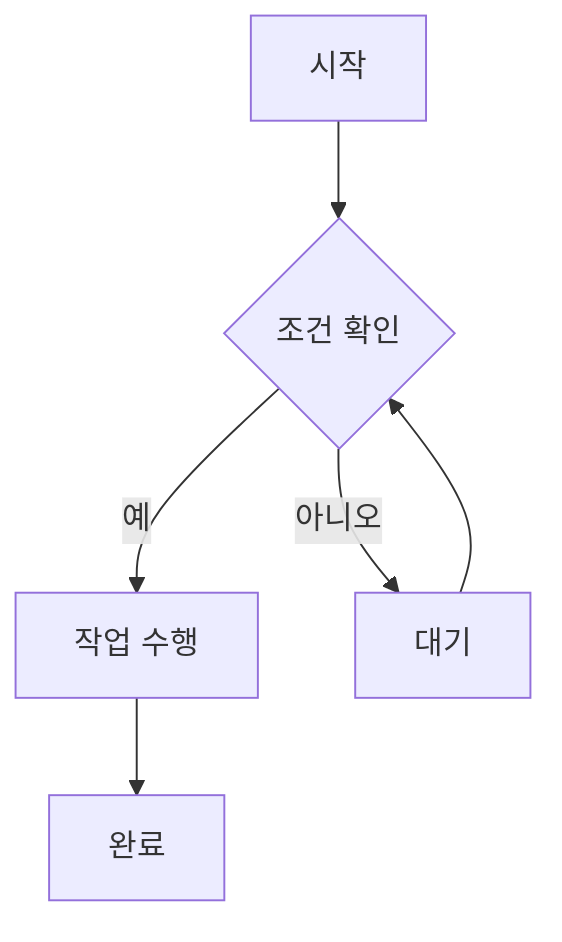

# 고급 예제

VitePress의 고급 기능들을 살펴보겠습니다.

## 수학 공식

VitePress는 LaTeX 문법을 이용한 수학 공식을 지원합니다.

인라인 수식: $E = mc^2$

블록 수식:
$$
\frac{1}{2} \sum_{i=1}^{n} x_i^2
$$

## 다이어그램 (Mermaid)



## 코드 그룹

::: code-group

```js [config.js]
export default {
  title: 'VitePress',
  description: '정적 사이트 생성기'
}
```

```ts [config.ts]
import { defineConfig } from 'vitepress'

export default defineConfig({
  title: 'VitePress',
  description: '정적 사이트 생성기'
})
```

:::

## 파일 트리

```
docs/
├── .vitepress/
│   └── config.js
├── guide/
│   ├── getting-started.md
│   └── installation.md
└── index.md
```

## 키보드 단축키

<kbd>Ctrl</kbd> + <kbd>C</kbd> : 복사
<kbd>Ctrl</kbd> + <kbd>V</kbd> : 붙여넣기
<kbd>Ctrl</kbd> + <kbd>S</kbd> : 저장

## 뱃지


## 주석

<!-- 이것은 주석입니다. 브라우저에서 보이지 않습니다. -->

## HTML 태그

VitePress에서는 마크다운 안에 HTML 태그도 사용할 수 있습니다:

<div style="color: red; font-weight: bold;">
  빨간색 굵은 글씨
</div>

<details>
<summary>클릭하여 펼치기</summary>
숨겨진 내용입니다!
</details>

## 각주

이것은 각주가 있는 텍스트입니다[^1].

[^1]: 이것이 각주의 내용입니다.

## 하이라이트

==하이라이트된 텍스트==

## 구독/위첨자

H~2~O (아래첨자)
2^10^ = 1024 (위첨자)

## 테이블 고급 기능

| 왼쪽 정렬 | 가운데 정렬 | 오른쪽 정렬 |
|:----------|:-----------:|-----------:|
| 내용 1    | 내용 2      | 내용 3     |
| 긴 내용   | 짧은 내용   | 보통 내용  |