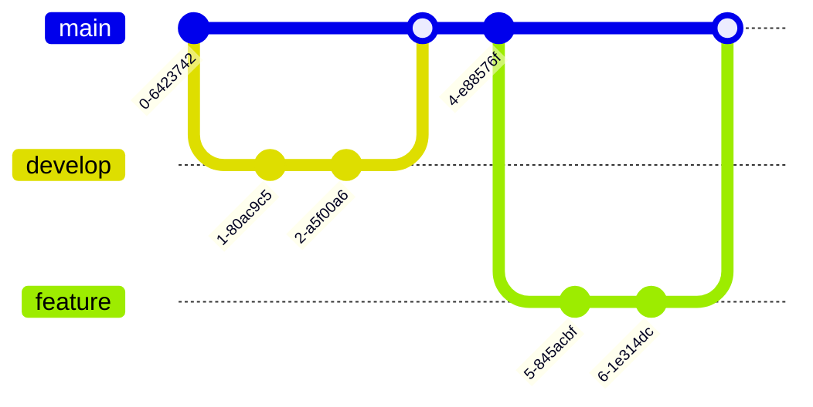

# Mermaid 다이어그램

VitePress에서 Mermaid를 사용하여 다양한 다이어그램을 그릴 수 있습니다.

## 플로우차트

## 클래스 다이어그램

## 시퀀스

## 엔티티 관계도

## 상태 다이어그램

## 마인드맵

## 간트

## Git 그래프

## 칸반

## 패킷

## 파이

## quadrantChart

## 레이더

## 요구사항

## 타임라인

## 트리맵

## journey

## xychart

